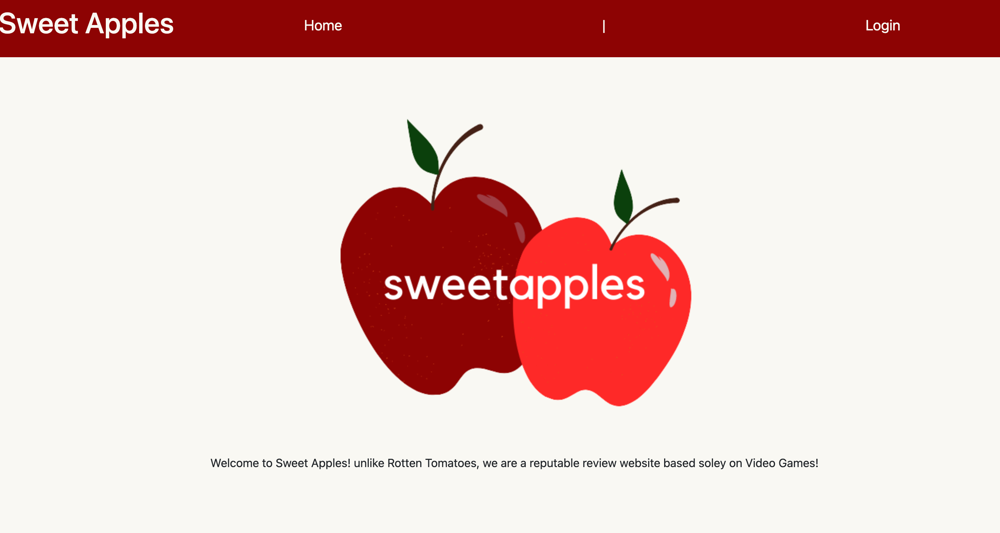
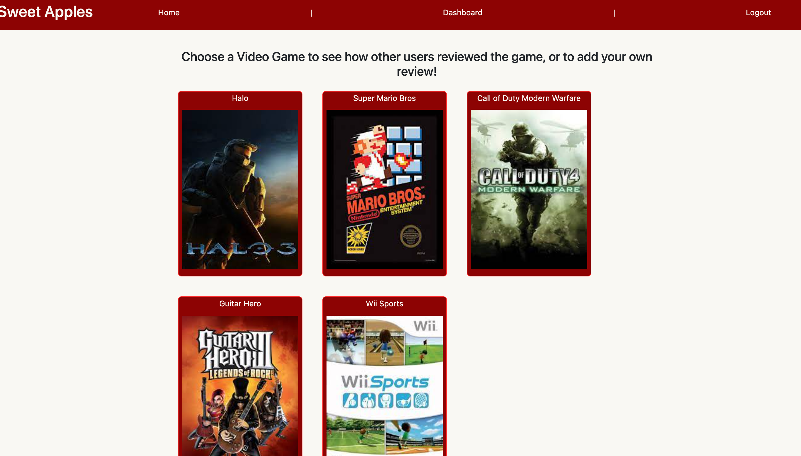

# Sweet Apples!
Sweet Apples is a user friendly website targeted to an audience that loves videogames! The site allows users to view and write reviews for video games

Created by Charlotte Clark, Kevin Tran, and Stephen Ryan

When this Website loads in you will be shown the title of the site labeled "Sweet Apples" as well as a header that includes the title "home" and right along side of that a login feature that will redirect you to a page to log in! Below will have the following functionality of the website

* When you press login it will direct you to a page where you can then sign up and log in

* when you have signed up you will then be redirected to the home page where a dahsboard opetion will appear in the header as well as a logout option

* When you log out it will log you out

* When you click on the dashboard button at the top it will redirect you to another page

* On this dashboard page you can choose what video games to add a review to

* When you click on one of these video games you will see previous reviews as well as give you an option to write your own review that you can delete if you choose to

This webstie was created using five main coding languages, those being Javascript, HTML, CSS, MySQL, Handlebars, and lastly Json

[Sweet Apples](https://ancient-plains-02897.herokuapp.com/)

Please contact charlotte.clark@alumni.usc.edu with any questions.
